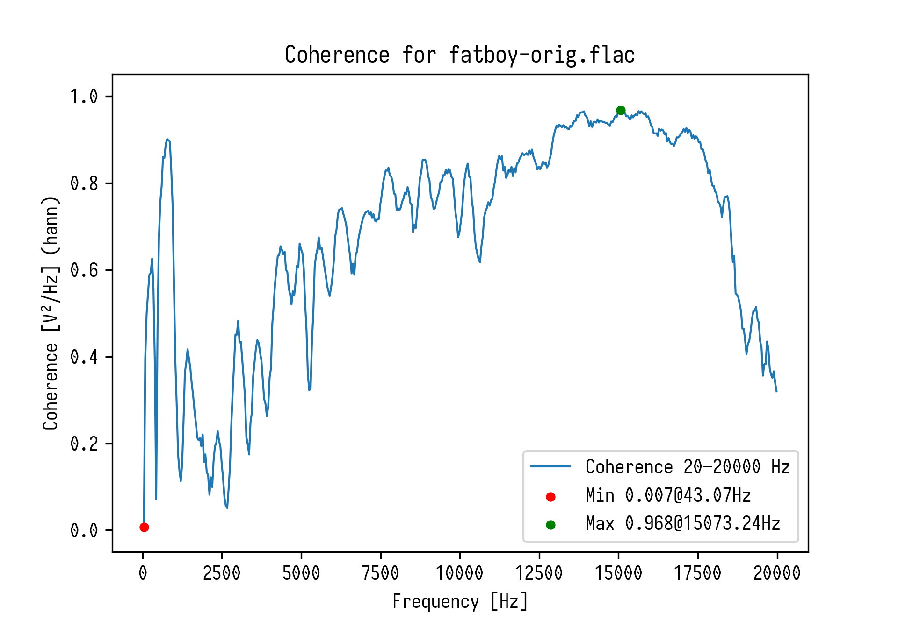

# sound_MESA

`sound_MESA.py`
Analyse PSD/Frequency of audio files, sndfile supports most common formats.

`sound_coherence.py`
Analyse Coherence of stereo file's two channels.

## Screenshot

## Installation
needs https://github.com/martini-alessandro/Maximum-Entropy-Spectrum
other requirements: numpy matplotlib soundfile pyloudnorm argparse
