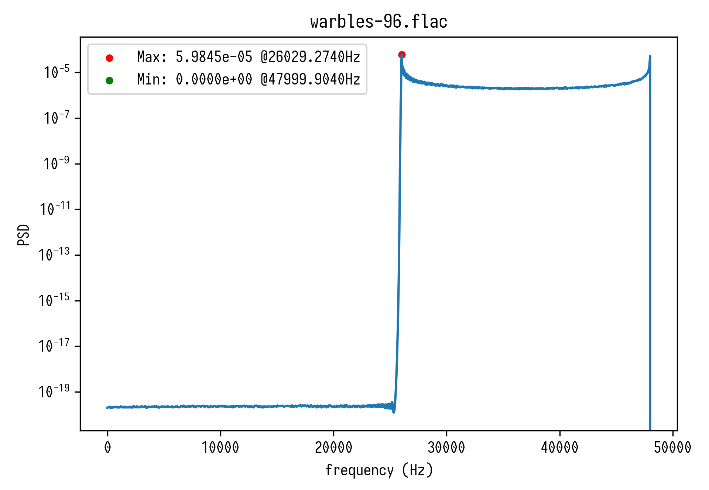

# sound_MESA

Analyse PSD/Frequency of audio files, sndfile supports most common formats.

## Screenshot

## Installation
needs https://github.com/martini-alessandro/Maximum-Entropy-Spectrum
other requirements: numpy matplotlib soundfile pyloudnorm argparse
